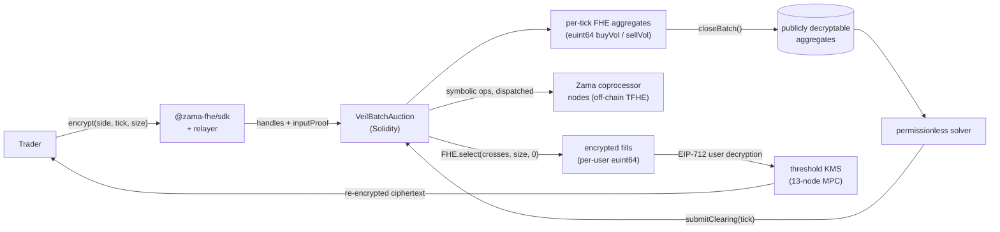

# Veil

**Confidential MEV-resistant CLOB DEX with cross-margined lending — built on the Zama Protocol (FHEVM)**

   

---

## The Problem

Every order book on Ethereum reveals state at match time. "Private" DEXes shipped to date use sequencer secrecy or commit-reveal latency — they just race to settle before the leak matters. Bots see your hand the moment it touches the chain, copy it, sandwich it, and front-run it. Lending protocols compound the problem: a public health factor is a public liquidation target. Privacy framed as a head start isn't privacy — it's a race the user always loses.

## The Solution

A sealed-bid uniform-price batch-auction CLOB where side, price tick, and size are encrypted end-to-end under FHE. Per-tick aggregate volumes accumulate as ciphertexts on-chain. After the batch closes the aggregates become publicly decryptable; any solver computes the one clearing tick; per-user fills are computed under FHE and remain user-decryptable only.

```solidity
// place an encrypted sealed bid: side, price-tick, and size all hidden
function placeOrder(
    externalEbool sideExt,
    externalEuint8 tickExt,
    externalEuint64 sizeExt,
    bytes calldata proof
) external;
```

```ts
import { useEncrypt } from "@zama-fhe/react-sdk";
import { useWriteContract } from "wagmi";

const { handles, inputProof } = await encrypt.mutateAsync({
  values: [
    { value: side === "buy", type: "ebool" },     // direction sealed
    { value: BigInt(tickIdx), type: "euint8" },   // price level sealed
    { value: BigInt(size),    type: "euint64" },  // size sealed
  ],
  contractAddress: VEIL_ADDRESS,
  userAddress,
});

await writeContract({
  address: VEIL_ADDRESS,
  abi: veilAbi,
  functionName: "placeOrder",
  args: [...handles.map(toHex), toHex(inputProof)],
});
```

The trader's browser is the only place the plaintext ever exists. Nothing the contract, the mempool, the coprocessor, or another trader observes is enough to reconstruct the order.

---

## Architecture



The trader and the solver are the only honest participants the protocol asks for. The contract holds only ciphertexts; the coprocessor runs symbolic FHE ops; the KMS only releases per-user fills under a valid EIP-712 signature; the solver only ever learns the aggregate-decrypted depth at close.

---

## Live Sepolia

| Artifact | Address | Explorer |
|---|---|---|
| `VeilBatchAuction` contract | _not yet deployed — pending Hardhat vars setup_ | — |
| Frontend (Veil) | _local dev: http://localhost:3000_ | — |
| Frontend (Mist · TokenOps Bounty) | _local dev: http://localhost:3031_ | — |
| Confidential Wrappers Registry | inherited from Zama | [docs](https://docs.zama.org/protocol/protocol-apps/registry-contract) |

> **Note (May 28, 2026):** the v0 contract is intentionally small — 4 price ticks,
> no pro-rata at the marginal tick, no escrow on `placeOrder` yet. The mechanism
> is end-to-end provable on the FHEVM mock; the v1 upgrade (pro-rata + ERC-7984
> escrow) lands in week 2.

---

## The Four Functions

The entire on-chain CLOB surface:

| Function | Visibility | What it does |
|---|---|---|
| `placeOrder(sideExt, tickExt, sizeExt, proof)` | external · trader | Posts a single sealed bid into the current batch. Adds the encrypted size to per-tick aggregate volumes via `FHE.select(isBuy && tick==t, size, 0)` for every tick `t`. Stores the order's ciphertexts with `FHE.allowThis` + `FHE.allow(msg.sender)` so the trader can later decrypt their own fill. |
| `closeBatch()` | external · permissionless | Idempotent once the close block is reached. Flips the batch to `Closed`, then `FHE.makePubliclyDecryptable(b.buyVolume[t])` + `sellVolume[t]` for every tick — any solver can now decrypt the aggregate ladder. Opens the next batch. |
| `submitClearing(batchId, clearingTick)` | external · permissionless | Sets the uniform clearing tick computed off-chain from the public aggregates. Walks the encrypted orders, computes `fills = (isBuy && tick≥C) ∥ (!isBuy && tick≤C)`, and writes each user's `filledSize = FHE.select(fills, size, 0)`. Per-user fill ciphertexts are re-allowed to the trader. |
| `getOrderFill(batchId, idx)` | view · trader (post-clearing) | Returns the trader's encrypted fill handle. Decryptable only by the original `msg.sender` via EIP-712, through the Zama relayer + 13-node threshold KMS. |

Plus the per-tick aggregate readers (`getBuyVolume` / `getSellVolume`) for solvers, and the batch-state readers (`getBatchState` / `getOrderCount`) for any indexer.

---

## Mechanism

A sealed-bid, uniform-price batch auction in five steps:

1. **Encrypt locally.** Side, price tick, and size are encrypted in the browser via the Zama relayer. Plaintext never leaves the device.
2. **Seal on-chain.** A single `placeOrder` lands as ciphertext handles + a ZK input-proof. Per-tick volumes accumulate as encrypted aggregates — unreadable to the contract itself.
3. **Batch closes.** After a fixed block window the batch seals. No order, depth, or imbalance was ever observable while it was open.
4. **Uniform clearing.** Aggregates are made publicly decryptable; any solver computes the one clearing tick. Everyone trades at the same fair price.
5. **Private fills.** Per-user fills are computed under FHE and stay decryptable only by the trader via EIP-712. The book reveals totals, never identities.

---

## Security Architecture

| Layer | Mechanism | Enforcement |
|---|---|---|
| Order confidentiality | TFHE-encrypted `ebool` side, `euint8` tick, `euint64` size | Plaintext never on the wire; ciphertext handles only |
| Depth confidentiality | Per-tick `euint64` aggregates updated via `FHE.select` | No observer (contract, coprocessor node, RPC, MEV bot) reads cleartext while batch is open |
| Per-user fill privacy | `FHE.allow(filledSize, trader)` after clearing | Only the trader can call user-decryption on their own ciphertext |
| Aggregate-only public reveal | `FHE.makePubliclyDecryptable(buyVol[t])` at close | Solver sees ladder totals; never individual orders |
| Decryption authority | 13-node threshold KMS (Zama Gateway), 2/3 majority | Single-node compromise reveals nothing |
| Input integrity | ZK input-proof attached to every `placeOrder` | Coprocessor rejects unverifiable ciphertexts |
| ACL on ciphertexts | `FHE.allowThis` + `FHE.allow(msg.sender)` on all stored handles | Compile-time guarantee that handles can't be read by unauthorised principals |
| Replay-resistant user decryption | EIP-712 typed signature, scoped to ciphertext handle + contract | Captured signatures don't generalise across handles |
| Liquidation privacy (Week 4) | Encrypted `euint64` health factor; `FHE.select` drives liquidation flag | Only the keeper can decrypt the flag, and only when it flips |
| Compliance hatch (Week 5) | Delegated decryption to a regulator key, ACL-bound to a contract scope | Auditable without exposing the book to the public |

### Security Notice

The Solidity contracts **have not been audited.** They have a Hardhat test suite passing 4/4 on the FHEVM mock and have been designed against the operations restrictions in `docs.zama.org/protocol/solidity-guides/smart-contract/operations` (no division-by-encrypted, no encrypted loop bounds, etc.). Production deployment of the v1 contract should await a formal audit; the v0 in this repo is a grant-submission prototype.

---

## Monorepo Structure

```
zama_grant/
├── contracts/                          # Hardhat + @fhevm/solidity workspace
│   ├── contracts/
│   │   └── VeilBatchAuction.sol        # v0 sealed-bid uniform-price CLOB
│   ├── deploy/deploy.ts                # hardhat-deploy script
│   ├── test/VeilBatchAuction.ts        # 4 tests, pass on the FHEVM mock
│   ├── tasks/                          # hardhat CLI tasks
│   └── hardhat.config.ts               # Sepolia + local FHEVM mock
├── web/                                # Veil landing + trade app (Builder Track)
│   ├── app/
│   │   ├── page.tsx                    # Aurora-theme landing
│   │   ├── app/page.tsx                # /app — live trading view
│   │   ├── providers.tsx               # Wagmi + @zama-fhe/react-sdk providers
│   │   └── globals.css                 # Aurora theme tokens + keyframes
│   ├── components/veil/
│   │   ├── primitives.tsx              # Cipher, Redacted, Pill, Wordmark, EthereumMark, Icon
│   │   ├── orderbook.tsx               # useBatchLifecycle + OrderBook + BatchPanel
│   │   ├── sections.tsx                # Nav / Hero / Mechanism / WhyFHE / Vault / Compliance / CTA / Footer
│   │   └── trade-app.tsx               # /app view — real encrypted-order placement
│   └── lib/
│       ├── abi.ts                      # hand-curated VeilBatchAuction ABI
│       ├── wagmi.ts                    # Sepolia config (injected connector)
│       └── zama-signer.ts              # local WagmiSigner shim (drops broken subscribe)
└── tokenops/                           # Mist — confidential disperse (Special Bounty)
    ├── app/                            # Next.js 16 App Router
    ├── components/disperse-panel.tsx   # paste recipients → encrypt → disperse
    └── lib/zama-signer.ts              # same shim, applied to the TokenOps SDK adapter
```

---

## Capabilities

| Capability | Detail |
|---|---|
| Encrypted CLOB primitive | Per-tick `euint64` aggregates accumulated under `FHE.add`+`FHE.select`; no plaintext exposure to contract, coprocessor, or RPC |
| Public aggregate reveal | `FHE.makePubliclyDecryptable` at `closeBatch`; aggregate-only — never per-order |
| Permissionless clearing | Off-chain solver reads the published aggregates, picks the uniform clearing tick, calls `submitClearing` |
| Per-user user-decryption | EIP-712 + 13-node threshold KMS; only the trader's signature unlocks their fill |
| Aurora frontend | Next.js 16 App Router + Tailwind v4; live encrypted-batch panel that cycles `open → closing → clearing → cleared` |
| Real on-chain encryption from the browser | Wagmi + `@zama-fhe/react-sdk`'s `useEncrypt` + `useWriteContract`; ciphertext handles flow direct from form → relayer → contract |
| TokenOps confidential disperse (Mist) | Paste `address amount` lines → preflight via `@tokenops/sdk/fhe-disperse/react` → encrypt amounts → single ERC-7984 transfer |
| Aurora brand system | Two-stroke V-mark with horizontal slits in a cyan→violet gradient, used as the V of the wordmark; Space Grotesk display + JetBrains Mono |

---

## Deployed

| Surface | Where | Status |
|---|---|---|
| `VeilBatchAuction` contract | Sepolia | ⬜ awaiting Hardhat vars (`MNEMONIC`, `INFURA_API_KEY`) |
| Veil frontend | Vercel | ⬜ pending Sepolia deploy |
| Mist (TokenOps disperse) | Vercel | ⬜ pending |
| Mainnet | — | Phase 6+ (post-audit) |

---

## Phase Status

- ✅ **Week 1** — Monorepo bootstrapped · `VeilBatchAuction.sol` (v0) compiles & tests pass 4/4 on the FHEVM mock · Aurora-theme landing + trade-app frontend with real `useEncrypt` wiring · Mist (TokenOps disperse) scaffolded with `@tokenops/sdk/fhe-disperse/react`
- ⬜ **Week 2** — v1 contract: pro-rata fills at the marginal tick · ERC-7984 escrow on `placeOrder` and refund on `closeBatch` for non-crossing orders
- ⬜ **Week 3** — ERC-7984 settlement wired through the trade app · Off-chain clearing solver bot · User-decryption of fills via EIP-712
- ⬜ **Week 4** — Cross-margin lending vault with encrypted `euint64` health factor · Liquidation eligibility under FHE · Delegated decryption to permissionless keepers
- ⬜ **Week 5** — Composition: CLOB ↔ lending vault cross-margining · Regulator-key compliance ACL via delegated decryption
- ⬜ **Week 6** — Sepolia deploy · gas/latency benchmarks · 3-minute pitch video · Builder Track + TokenOps Special Bounty submissions

Submission deadline: **2026-07-07 (23:59 AOE)**.

---

## Build & Test

Prerequisites: Node ≥ 20, npm ≥ 7. Hardhat vars (`MNEMONIC`, `INFURA_API_KEY`, optional `ETHERSCAN_API_KEY`) required only for Sepolia.

```bash
# 1. Contracts — FHEVM mock + Hardhat
cd contracts
npm install
npx hardhat compile
npx hardhat test test/VeilBatchAuction.ts     # 4 passing

# 2. Veil frontend — http://localhost:3000
cd ../web
npm install
cp .env.local.example .env.local              # set NEXT_PUBLIC_VEIL_ADDRESS post-deploy
npm run dev                                   # webpack mode — see Known Notes

# 3. Mist (TokenOps disperse) — http://localhost:3031
cd ../tokenops
npm install
cp .env.local.example .env.local              # set NEXT_PUBLIC_DISPERSE_TOKEN to any ERC-7984
npm run dev
```

To deploy `VeilBatchAuction` to Sepolia once your Hardhat vars are set:

```bash
cd contracts
npx hardhat vars set MNEMONIC
npx hardhat vars set INFURA_API_KEY
npx hardhat deploy --network sepolia
npx hardhat verify --network sepolia <CONTRACT_ADDRESS> 10
```

---

## Known Notes

- **Both Next apps run `next dev/build --webpack`.** Turbopack 16 currently fails to parse `@zama-fhe/sdk`'s right-associative `**` operator; webpack mode handles it. Scripts already pass the flag.
- **`watchConnection` shim.** Both `web/` and `tokenops/` swap `@zama-fhe/react-sdk/wagmi`'s `WagmiSigner` for a local `lib/zama-signer.ts`. The upstream signer imports a `watchConnection` symbol that current wagmi versions no longer export; the local copy omits the optional `subscribe` lifecycle hook and keeps the rest of the surface intact.
- **`@tokenops/sdk` wagmi pin.** `@tokenops/sdk` peer-pins wagmi `^2.0.0` but the Zama React SDK needs the wagmi v3 API. Resolved via an `overrides.wagmi` in `tokenops/package.json`.

---

## License

MIT. The `contracts/` workspace inherits the BSD-3-Clause-Clear of the `zama-ai/fhevm-hardhat-template` it was bootstrapped from; everything else is MIT.

Submission to the [Zama Developer Program Mainnet Season 3 — Builder Track](https://www.zama.org/programs/developer-program). The Mist workspace targets the same season's TokenOps Special Bounty. Theme: *Composable Privacy Is the Key*.
