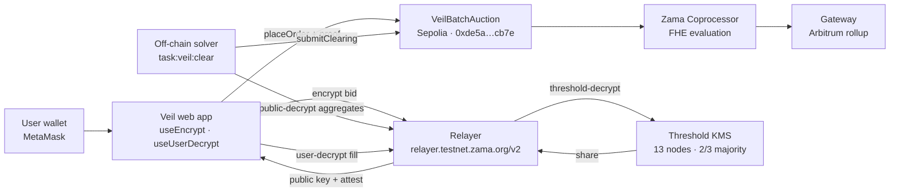
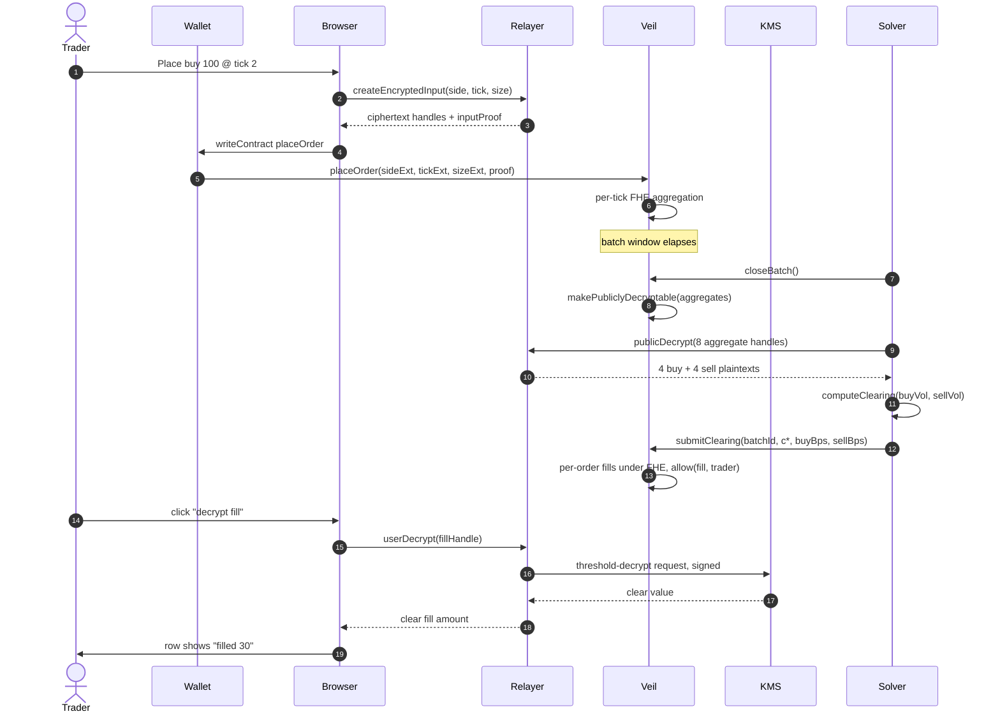

# Veil — System Architecture

Status: draft · Last updated: 2026-05-29

## Components

Each component, with its source-of-truth in the codebase:

- **User wallet**. Standard EIP-1193 provider (MetaMask). Out-of-process from the app.
- **Veil web app**. Next.js 16 App Router, `/app` route renders `TradeApp`. Encryption goes through `useEncrypt` from `@zama-fhe/react-sdk`; user-decryption goes through `useUserDecrypt`. See `web/components/veil/trade-app.tsx`, `web/lib/use-veil-lifecycle.ts`.
- **VeilBatchAuction contract**. Solidity 0.8.27 with `viaIR`. Source: `contracts/contracts/VeilBatchAuction.sol`. Deployed to Sepolia at `0xde5aC3708831BDd2DfDbF00614A2717f76eacb7e`.
- **Zama Coprocessor**. Evaluates FHE circuits on behalf of the host chain. Veil emits ACL events the coprocessor honors. Out-of-scope to operate.
- **Threshold KMS**. 13 nodes running in AWS Nitro Enclaves, 2/3 majority threshold MPC. Holds shares of the FHE secret key; performs user-decryption and public-decryption on signed requests.
- **Gateway**. Zama's Arbitrum rollup that aggregates ACL events from host chains and orchestrates KMS requests. We never call it directly.
- **Relayer**. HTTP gateway in front of the Gateway + KMS at `relayer.testnet.zama.org/v2`. The browser SDK talks to it for the TFHE public key (for encryption), for public-decryption of handles, and for user-decryption sessions. Configured via `SepoliaConfig` from `@zama-fhe/react-sdk`.
- **Off-chain solver**. Currently a Hardhat task at `contracts/tasks/Veil.ts` exposing `task:veil:close` and `task:veil:clear`. Computes the uniform clearing tick + per-side bps from publicly-decrypted aggregates and calls `submitClearing`. Trustless for correctness (anyone can recompute), trusted for liveness.

## Leakage map

Who sees what at each step of the protocol. The unit is "what an honest party can observe by inspecting public state and their own private state."

| Step                                | Public observer                                              | Solver                                | Trader (own order)                            | KMS                                  |
|-------------------------------------|--------------------------------------------------------------|---------------------------------------|-----------------------------------------------|--------------------------------------|
| `placeOrder` tx broadcast           | trader address, opaque ciphertext bytes, gas cost            | —                                     | side, tick, size (the values they typed)      | —                                    |
| `OrderPlaced` event emitted         | **`batchId`, trader address, `orderIndex`** (event indexes batchId + trader) | —                                     | own order                                     | —                                    |
| Batch open, between submissions     | aggregate ciphertext handles, order count, set of trader addresses participating | —                                     | own order                                     | —                                    |
| `closeBatch`                        | aggregate handles flip to publicly-decryptable               | —                                     | —                                             | —                                    |
| Public-decrypt aggregates           | per-tick buy and sell totals                                  | per-tick buy and sell totals          | —                                             | shares of those totals               |
| `submitClearing`                    | clearing tick, marginal bps                                  | the values it just submitted          | —                                             | —                                    |
| `getOrderFill` view                 | opaque ciphertext handle for each order                      | —                                     | —                                             | —                                    |
| User-decrypt fill                   | —                                                            | —                                     | own clear fill amount                         | shares of that amount                |

Three properties to highlight:

1. **No trader learns another trader's order, fill, or pre-clearing intent.** Aggregates leak the *shape* of the book after close (how much demand and supply sat at each tick), which is the minimum needed for honest price discovery.
2. **Individual orders are never decrypted in transit.** The relayer sees ciphertext handles; the KMS sees encrypted shares. Nothing in the protocol path holds enough material to reconstruct an order in plaintext.
3. **The set of participants is public.** `OrderPlaced` is emitted with `batchId` and `trader` indexed, so an outside observer trivially gets the address-set that placed orders in any batch. Veil hides *what* you traded, not *that* you traded. Mitigations (relayer-funded submissions, AA bundling, mixer-in-front, or accepting the disclosure) are tracked in `07-security.md` and the future ADR-011.

## End-to-end sequence

## Trust boundaries

1. **Trader ↔ browser.** Standard wallet trust. The browser can lie about what it encrypted; if the user runs a hostile dApp they lose. Out of scope.
2. **Browser ↔ relayer.** Relayer learns ciphertext handles and routes them. It can drop or delay requests (liveness attack), it cannot decrypt anything (no key shares). Relayer is operated by Zama today; community-run relayers planned.
3. **Veil ↔ coprocessor.** Standard FHEVM trust. The coprocessor cluster evaluates FHE circuits and posts results to the Gateway under majority consensus across coprocessors. Veil emits the right ACL events; the coprocessor honors them.
4. **KMS quorum.** 13 nodes (the KMS half of Zama's 18 genesis operators; the other 5 are coprocessors), running in AWS Nitro Enclaves. Two distinct thresholds apply:
   - *Correctness.* The robust MPC protocol returns a correct decryption result as long as **at most ⌊13/3⌋ = 4 nodes are malicious** (per the litepaper). 5+ malicious nodes can force the protocol to abort or produce a wrong output.
   - *Confidentiality.* The FHE secret is shared with a 2/3 reconstruction threshold. Recovering it requires **≥9 colluding KMS nodes** *and* breaking Nitro Enclave attestation on each.

   The honest summary: confidentiality breaks under the combined attack of 9+ KMS node compromise plus AWS attestation defeat; correctness breaks under 5+ node compromise alone. A single bad actor breaks neither.
5. **Solver.** Trusted only for liveness, not correctness. Anyone can recompute `(c*, marginalBuyBps, marginalSellBps)` from the publicly-decrypted aggregates and verify it matches what was submitted on-chain. A malicious solver that submits wrong values is detectable; in v1 we don't yet enforce on-chain re-verification. v2 adds it (see `docs/08-decisions.md` ADR-003 for the trade-off, and `docs/07-security.md` for the malicious-solver attack model).

## Deployment topology

| Stage  | What it adds                                                                              | Status                    |
|--------|-------------------------------------------------------------------------------------------|---------------------------|
| v1     | VeilBatchAuction on Sepolia. Web app on localhost. Solver run manually via Hardhat task.   | shipped 2026-05-28        |
| v2     | + ERC-7984 escrow + per-user `settle()`. Web app deployed.                                 | planned, Week 2–3         |
| v3     | + cross-margin lending vault. Keeper bot automating the solver loop.                       | planned, Week 4–5         |
| v4     | + regulator-key registry. Sepolia frozen as canonical demo for grant submission.           | planned, Week 6           |
| Future | Ethereum mainnet (live since 2025-12-30 per Zama, $0.13/tx typical), EVM L2s (H1 2026 per Zama roadmap). | post-grant       |

Stage dates are intentionally soft. The roadmap commits to *order*, not to *calendar*. The canonical date table lives in `05-roadmap.md` and is the source of truth.

## Where each Veil component sits in the Zama litepaper stack

| Litepaper component | Veil's use                                                                 |
|---------------------|----------------------------------------------------------------------------|
| Host chain          | Sepolia today, Ethereum mainnet at v4.                                     |
| Coprocessor         | Zama's testnet coprocessor. Veil emits ACL events for `allow`/`allowThis`. |
| KMS                 | User-decryption for fills, public-decryption for aggregates. Delegated-decryption added in v3 for keeper liquidations. |
| Gateway             | We don't call it directly; it relays ACL events between Sepolia and KMS.   |
| Relayer             | `relayer.testnet.zama.org/v2` via `SepoliaConfig`. Holds no secrets.       |

For the canonical reference, see [docs.zama.org/protocol/zama-protocol-litepaper](https://docs.zama.org/protocol/zama-protocol-litepaper).

## Open questions

- **Indexed-trader leakage mitigation.** The leakage map row (`OrderPlaced` indexed `trader`) is a real disclosure. Candidate mitigations: a Veil-funded relayer that submits on the trader's behalf via account abstraction; a stealth-address scheme; or accepting the disclosure and documenting it. None designed yet. ADR-011 will land in `08-decisions.md`.
- **Solver on-chain verification.** v1 trusts the solver for liveness and verifies correctness off-chain. The architecture diagram pretends the solver is a single trusted box; v2 should either (a) require any account to be able to challenge a wrong submission within a grace window or (b) re-verify on-chain at gas cost. Open.
- **Relayer single-point-of-failure.** Today's relayer is `relayer.testnet.zama.org/v2`, operated by Zama. The whole encrypt/decrypt path routes through it. Zama documents community-run relayers as a roadmap item; until then the architecture has a centralised liveness dependency that the doc should not pretend away.
- **Cross-chain story.** Veil is single-chain (Sepolia → mainnet). The Gateway in principle supports cross-chain ACL, but we have no design for routing orders between host chains. Out of scope for the grant; flag for v5+.
